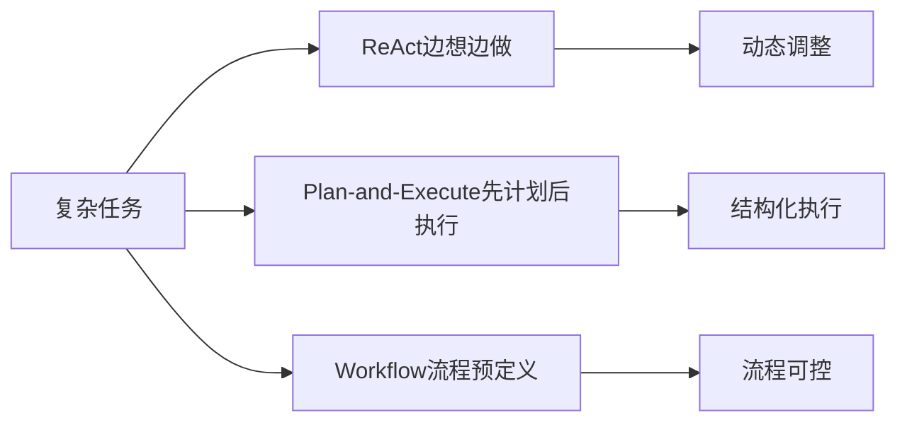

# Agent 范式

> 路径：AI Agent
>
> https://app.notion.com/p/3d1776baec498135af31dd1acca836a8?pvs=204

这一层记录不同 Agent 如何组织“思考—行动—反馈”。
## 先理解一个核心问题
LLM 本身主要负责生成下一步输出，但一个 Agent 要完成复杂任务，通常还需要决定：**下一步做什么、什么时候行动、什么时候继续、什么时候结束。**
因此，“Agent 范式”不是另一堆组件，而是**组织这些能力的方式**。
## ReAct：让模型边想边做
**ReAct = Reasoning + Acting**。
它出现的动机是：如果让模型一次性把复杂任务全部想完再执行，遇到真实环境中的未知结果时就很难调整；如果只让模型不断调用工具，又缺少对当前情况的判断。
所以 ReAct 把两者交替起来：
`观察当前状态 → 思考下一步 → 行动 / 调用工具 → 得到结果 → 再观察 → 再思考`
核心特点：**计划不是一次性写死的，而是在执行过程中不断更新。**
它特别适合需要根据工具返回结果动态调整的任务。
## Plan-and-Execute：先计划，再执行
它针对的是另一种需求：任务比较复杂，如果每一步都临时决定，整体方向可能不稳定。
因此可以先由一个 Planner 制定较完整的计划，再交给 Executor 按步骤执行；如果执行过程中出现问题，也可以重新规划。
`任务 → 制定计划 → 执行步骤 → 检查结果 → 必要时重新规划`
与 ReAct 的关键区别不是“有没有思考”，而是**计划发生在什么时候、计划有多稳定**：
- **ReAct**：计划与行动交替发生，边做边调整。
- **Plan-and-Execute**：先形成较明确的计划，再执行。
## Workflow：把流程本身写出来
Workflow 更强调**流程由人预先定义**，而不是让 LLM 自己决定整个流程。
例如：
`输入 → 检索 → 总结 → 审核 → 输出`
每个节点做什么、先后关系是什么，都可以提前规定。LLM 可以参与某些节点，但不一定负责决定整个流程。
因此 Workflow 和 Agent 不是简单的同义词：
- **Workflow**：控制逻辑主要由程序预先规定。
- **Agent**：控制逻辑的一部分交给模型，让模型根据当前状态决定下一步。
## 三者放在同一张图里

它们不是简单的“谁更先进”，而是在**控制权**上做不同取舍：
`更多程序控制 ← Workflow ← Plan-and-Execute / ReAct → 更多模型控制`
实际系统还可以混合使用，例如：Workflow 规定大框架，某个节点内部使用 ReAct Agent；或者 Agent 先制定计划，再用工具逐步执行。
## 学习时要抓住的关系
- **Agent → Agent 范式**：Agent 是系统形态，范式是组织其思考、行动、反馈的方式。
- **ReAct ↔ Tool Calling / Tool Runtime**：ReAct 决定“什么时候行动、下一步做什么”，Tool Calling 负责把行动表达成结构化调用，Runtime 负责真正执行。
- **Plan-and-Execute ↔ Planning**：它是 Planning 思想的一种典型组织方式。
- **Workflow ⤢ Agent**：不是绝对互斥；Workflow 可以包含 Agent，Agent 也可以运行在 Workflow 中。
## 当前学习重点
暂时不需要记住所有 Agent 范式。先真正理解 **ReAct 为什么需要循环，以及“谁控制下一步”**，再去比较其它范式。
## 计划收录
- ReAct
- Plan-and-Execute
- Workflow
- 其它常见 Agent 范式
重点记录：为什么出现、控制权在哪里、循环如何发生、适合什么任务，以及彼此差异。
## 📚 第四章学习总结：三种经典 Agent 范式（2026-09-04）
第四章真正要理解的不是“背三个名字”，而是：**不同范式把“下一步怎么做”的控制方式组织成了不同结构。**
### ReAct：边想边做
核心循环：`观察 → 思考 → 行动 → 得到结果 → 再观察 → 再思考`
- 计划不会一次性写死，而是在执行过程中根据工具返回结果动态调整。
- 适合实时信息多、环境会变化、需要根据中间结果灵活决定下一步的任务。
- 与 Tool Calling / Tool Runtime 的关系：ReAct 决定“什么时候行动、下一步做什么”；Tool Calling 把行动表达成结构化调用；Runtime 真正执行工具。
### Plan-and-Solve / Plan-and-Execute：先想好路线，再执行
核心流程：`任务 → 制定计划 → 执行步骤 → 检查结果 → 必要时重新规划`
- 适合步骤多、需要全局安排的复杂任务。
- 与 ReAct 的关键区别不是“有没有思考”，而是**计划发生在什么时候、计划有多稳定**：ReAct 是边做边调整；Plan-and-Execute 是先形成较明确的整体计划。
- 原本的静态计划可能被现实打乱，因此可以加入动态重规划：已经完成的步骤保留，只重新规划受影响的后续部分。
- 复杂任务还可以做分层规划：`大目标 → 高层计划 → 子任务 → 具体步骤 → 工具执行`，避免一次生成巨大而脆弱的完整计划。
### Reflection：做完以后检查和修正
核心循环：`生成结果 → 反思/评审 → 找问题 → 修改 → 再检查`
- 主要解决“第一次结果可能不够好”的问题。
- 与前两个范式相比，更关注**结果质量**，而不是单纯决定下一步行动。
- Reflection 不应该变成“为了改而改”：只有发现有实际价值的问题才应该修改。如果当前方案已经合理，应停止，而不是强行找一个问题。
### 三种范式怎么选？
- **ReAct**：任务需要实时反馈和灵活调整 → 边想边做。
- **Plan-and-Execute**：任务复杂、步骤较多，需要全局路线 → 先规划再执行。
- **Reflection**：已有结果需要质量检查和迭代优化 → 反思、修改。
- 实际系统可以组合，例如：**Plan-and-Execute 负责全局规划 + ReAct 负责执行时动态调整**；也可以在关键结果上额外使用 Reflection。
## 🧠 第四章最重要的工程认识
### 1. Prompt 不只是“告诉模型任务是什么”
Prompt 还可以规定 Agent 的行为模式。例如：
- ReAct Prompt 重点约束 `Thought → Action → Observation` 的循环格式。
- Plan-and-Execute Prompt 重点要求模型先拆解任务、形成计划。
因此，**Prompt 是 Agent 控制逻辑的一部分**。
### 2. LLM 的自然语言输出与程序需要的确定结构之间存在接口问题
ReAct 中如果程序用正则表达式从自然语言里找 `Thought` / `Action`，模型只要稍微改变格式就可能解析失败。因此：
**自然语言适合交流，结构化数据更适合程序处理。**
Tool Calling 使用结构化调用就是在解决这个接口问题：模型输出工具名和参数，Runtime 再执行真正的 Python Tool。
### 3. Reflection 的停止条件不能靠简单子串匹配
例如反馈中出现“无需改进？否。当前算法严重劣化，必须改进”，如果程序直接写 `if "无需改进" in feedback`，就会错误停止。
更可靠的设计是让模型输出明确的二选一状态，例如 `[需要改进]` / `[无需改进]`，并让程序只读取这个结构化状态，而不是搜索整段自然语言。进一步还可以结合测试结果、质量阈值、连续多轮无实质改善等客观条件。
### 4. Reflection Prompt 要避免“为改而改”
“极其严格”“对性能有极致要求”“必须找出瓶颈”等措辞会诱导模型即使代码已经合理，也继续寻找问题，甚至把正确方案改坏。
更合理的角色可以是**开源项目维护者**：关注修改是否真的有价值，并明确要求“不要为了优化而优化；如果改动收益很小但复杂度增加，应保留原方案”。
### 5. 不同模型可以承担不同职责
可以让较强的模型负责 Reflection / 判断，较快的模型负责执行 / 生成，以降低成本和延迟。但要注意：强模型发现的问题，较弱的执行模型未必能正确修复，可能造成反复迭代。
## 🧩 第四章综合案例：客服 Agent
对于“查询订单和物流 → 查询公司政策 → 根据结果决定是否发送邮件”这类任务，可以采用：
**Plan-and-Execute + ReAct**。
- Plan-and-Execute：把复杂请求拆成交通式的多个子任务/处理阶段。
- ReAct：执行过程中根据订单、物流、政策查询结果动态改变下一步。
- Reflection 不适合作为主控制循环，因为客服强调即时响应；可以只在关键结果上辅助检查。
工具可以包括：**查询订单/物流、查询公司政策、发送邮件**。
其中发送邮件属于会产生外部副作用的操作，应该比单纯查询更谨慎，可在发送前增加确认或人工审核。
## 🌱 学完第四章后的理解
Agent 范式不是“哪个最先进”，而是在回答：**谁控制下一步？计划什么时候形成？遇到新信息时怎么调整？结果什么时候算够好？**
第四章之后，可以把一个 Agent 看成：LLM 的决策能力 + 工具执行能力 + 循环控制，再根据任务需要加入 Planning、Reflection 等组织能力。